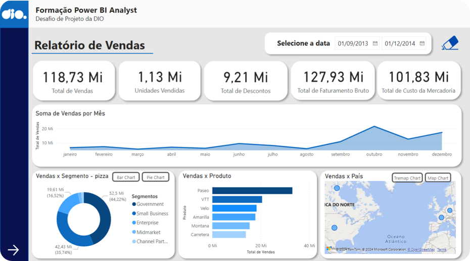

# Projeto de relatório de vendas

 
 
Projeto de relatório de vendas feito no desafio do bootcamp da DIO sobre análise de Power BI.

## Índice

- <a href='#tecnologias'>1. Tecnologias</a>
- <a href='#análises'>2. Análises</a>
- <a href='#sobre-mim'>3. Sobre mim</a> 

## Tecnologias

 Power BI Desktop com Power Querry

## Análises

O projeto realiza análises gráficas de uma amostra de dados financeiros de vendas ('📄 financial_sample.xlsx') utilizando filtros interativos capazes de demonstrar uma análise cronológica e granular dos dados.

O relatório possui duas páginas, a primeira mostra um panorama geral e específico, com filtros cronologicos, granulares e geográficos:

    

Enquanto a segunda página mostra um relatório mais detalhado acerca dos lucros dos produtos vendidos pela empresa:

    

O presente relatório permitiu insights de vendas como identificar os maiores e os menores produtos e segmentos de vendas, o melhor e o pior período de vendas no ano e ao longo da história da empresa - comparado com outros anos, além de insights sobre lucros como qual país obteve o maior lucro e qual trimestre teve o melhor resultado, entre outras informações que auxiliam a empresa na tomada de decisões estratégicas sobre seu futuro.

## Sobre mim

    
    

        

        Mateus Teixeira
        

        Pós-graduando em Inteligência Artifcial pela INFNET
         
         
        
        
        
    

